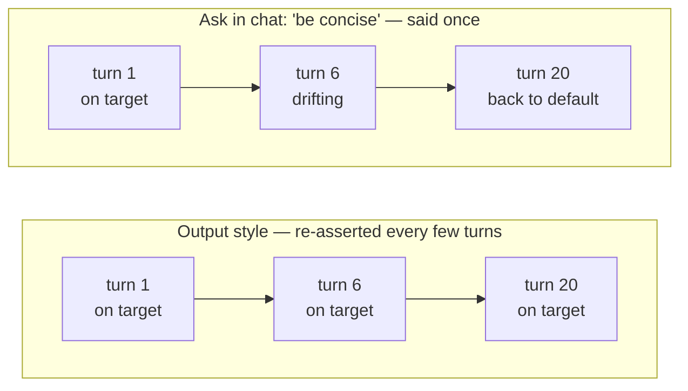

# ADHD output style for Claude Code

An output style that reshapes Claude Code's responses for an ADHD reader: the next action on line one, numbered steps, state restated every turn, no preamble and no closers.

It changes how Claude *talks to you*. It does not change how Claude writes code, comments, commit messages, or PR bodies — those keep their own conventions.

## Why I built this

I've been struggling with the output of the 5-gen models from Anthropic. The coding skills were sharp as ever, but reading the prose around the code became taxing on my brain. Huge walls of text, laden with impenetrable jargon and with the actions buried inside them, were taking a toll on me. My work was slowing down and my brain felt fried after work.

[ayghri/i-have-adhd](https://github.com/ayghri/i-have-adhd) was an excellent tool, but I kept running into the same issue: by turn 5 or 6 the instruction was lost and I was back to choking on word salad. So I decided to use that work as a basis for a custom output style, to see if persistent reminders helped. After a few days of testing, it works nicely — and I want to share it with others struggling with the same thing.

## Before / after

**Default**

> Great question! Let's think about this. Your auth flow has a few moving pieces, so I'll start by looking at how tokens are currently issued, then we can decide on the best approach. Let me know if you'd like me to dig deeper into any part of this.

**ADHD**

> Run `npm install jsonwebtoken`, then edit `src/auth.ts:42`.
>
> Step 3 of 5 done: schema updated. Next: backfill the new column.

## Why an output style?

You can just *ask* Claude to be concise and lead with the action. It works for about three turns.

An output style is different in one way that matters: it lives in the system prompt and is re-asserted every few turns for the entire session. It doesn't fade as the conversation grows, it doesn't get buried under the last twenty tool results, and it survives compaction. Formatting is exactly the kind of instruction that decays first — it isn't part of the task, so it's the first thing crowded out.



How the options compare:

| Approach | Scope | Holds up over a long session? |
|---|---|---|
| Ask in chat | This conversation | No — decays within a few turns |
| `CLAUDE.md` note | One project | Partly — but it competes with everything else in the file, and formatting loses |
| **Output style** | Every project, every session | Yes — reinforced for the whole session |

The other reason: it's one toggle. `/config` → **Default** and you're back to normal, with nothing to un-edit.

## Install

**For all your projects:**

```bash
mkdir -p ~/.claude/output-styles
curl -o ~/.claude/output-styles/adhd.md \
  https://raw.githubusercontent.com/axeslasher/adhd-output-style-for-claude-code/main/output-styles/adhd.md
```

**For one project only:**

```bash
mkdir -p .claude/output-styles
curl -o .claude/output-styles/adhd.md \
  https://raw.githubusercontent.com/axeslasher/adhd-output-style-for-claude-code/main/output-styles/adhd.md
```

Or just copy [`output-styles/adhd.md`](output-styles/adhd.md) into either directory by hand.

## Use

In Claude Code, run:

```
/config
```

Find the **Output style** setting and select **ADHD**. To switch back, open `/config` again and pick **Default**.

## What it actually enforces

Ten rules, each traced back to a fact about how ADHD brains read:

| Rule | Why |
|---|---|
| Lead with the next action | Starting is the hardest step |
| Number multi-step tasks | Working memory is small |
| End with one concrete next action | Knowing ≠ doing |
| Suppress tangents | One thread at a time survives |
| Restate state every turn | Nothing off-screen is retained |
| Specific time estimates | "Some work" and "a few hours" feel identical |
| Make completed work visible | Dopamine is scarce; buried wins don't register |
| Matter-of-fact tone for errors | Alarm words cost focus |
| Cap lists at five items | Five ranked beats ten unranked |
| No preamble, no recap, no closers | Every filler line pushes the answer off-screen |

Plus explicit escape hatches — the rules bend for "explain this to me," destructive actions, debug spirals, real ambiguity, and "what are my options."

## Tuning it

It's one markdown file. Edit it.

- **Too terse when you want teaching?** Loosen rule 1 in the *When to break the rules* section.
- **Want it to still ask before acting?** Delete the **Do, don't offer** bullet under *Agentic work*.
- **Different list cap?** Change the number in rule 9.

Keep the YAML frontmatter (`name` and `description`) intact — that's what `/config` lists the style by.

## Credits

Heavily inspired by [ayghri/i-have-adhd](https://github.com/ayghri/i-have-adhd) — a Claude Code plugin that pioneered this approach to action-first, ADHD-friendly assistant output. This repo reworks the idea as a native Claude Code output style. Go star the original.

## License

MIT — see [LICENSE](LICENSE).
