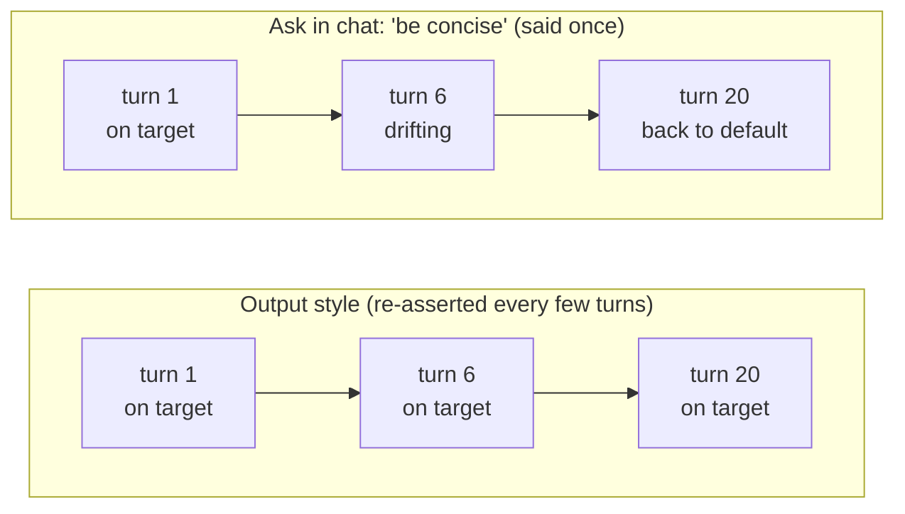

# ADHD output style for Claude Code

An output style that reshapes Claude Code's responses for an ADHD reader: the next action on line one, numbered steps, state restated every turn, no preamble and no closers.

It changes how Claude *talks to you*. It does not change how Claude writes code, comments, commit messages, or PR bodies; those keep their own conventions.

## Why I built this

I've been struggling with the output of the 5-gen models from Anthropic. The coding skills were sharp as ever, but reading the prose around the code became taxing on my brain. Huge walls of text, laden with impenetrable jargon and with the actions buried inside them, were taking a toll on me. My work was slowing down and my brain felt fried after work.

[ayghri/i-have-adhd](https://github.com/ayghri/i-have-adhd) was an excellent tool, but I kept running into the same issue: by turn 5 or 6 the instruction was lost and I was back to choking on word salad. So I decided to use that work as a basis for a custom output style, to see if persistent reminders helped. After a few days of testing, it works nicely; I want to share it with others struggling with the same thing.

## Before / after

You ask why one test suite reads a stale environment variable.

**Default**

> I'd be happy to help with that! Before we dive in, it's worth understanding how your test runner resolves environment variables, since that's a common source of this kind of failure. There are a few possibilities here: the env file may not be loading at all, the variable may be shadowed by something already exported in your shell, or the runner may be holding a cached value from a previous run. I'd suggest adding some logging first so we can see what's actually being read, and from there we can narrow things down. Let me know how that goes!

**ADHD**

> `.env.test` never loads; `vitest.config.ts` has no `setupFiles` entry.
>
> 1. Add `setupFiles: ['./test/setup.ts']` to `vitest.config.ts`
> 2. Put `import 'dotenv/config'` at the top of `test/setup.ts`
> 3. Run `npx vitest run billing.spec.ts`
>
> About 2 minutes. Step 3 of 4 done on the test-config cleanup; next is deleting the duplicate `dotenv` call in `vite.config.ts`.

## How it stays in effect

You can just *ask* Claude to be concise and lead with the action. It works for about three turns.

An output style is different in one way that matters: it lives in the system prompt and is re-asserted every few turns for the entire session. It doesn't fade as the conversation grows, it doesn't get buried under the last twenty tool results, and it survives compaction. Formatting is exactly the kind of instruction that decays first; it isn't part of the task, so it's the first thing crowded out.



How the options compare:

| Approach | Scope | Holds up over a long session? |
|---|---|---|
| Ask in chat | This conversation | No (decays within a few turns) |
| `CLAUDE.md` note | One project | Partly (it competes with everything else in the file, and formatting loses) |
| **Output style** | Every project, every session | Yes (reinforced for the whole session) |

The other reason: it's one toggle. `/config` → **Default** and you're back to normal, with nothing to un-edit.

## Install

**For all your projects:**

```bash
mkdir -p ~/.claude/output-styles
curl -o ~/.claude/output-styles/adhd.md \
  https://raw.githubusercontent.com/axeslasher/adhd-output-style-for-claude-code/main/output-styles/adhd.md
```

**For one project only:**

```bash
mkdir -p .claude/output-styles
curl -o .claude/output-styles/adhd.md \
  https://raw.githubusercontent.com/axeslasher/adhd-output-style-for-claude-code/main/output-styles/adhd.md
```

**Pinned to a release** (so an upstream rule change never surprises you):

```bash
curl -o ~/.claude/output-styles/adhd.md \
  https://raw.githubusercontent.com/axeslasher/adhd-output-style-for-claude-code/v1.0.0/output-styles/adhd.md
```

Or just copy [`output-styles/adhd.md`](output-styles/adhd.md) into either directory by hand.

## Use

In Claude Code, run:

```
/config
```

Find the **Output style** setting and select **ADHD**. To switch back, open `/config` again and pick **Default**.

## What it actually enforces

The file starts from five facts about how an ADHD brain reads, then derives the rules from them. When a situation isn't covered by a rule, Claude is told to reason from the facts instead of pattern-matching the examples:

| The fact | What it forces |
|---|---|
| Working memory is small; anything off-screen is gone | State restated every turn; lists capped at five; tangents held until the end |
| Knowing the answer is not doing the answer | Every reply ends on one action doable in under two minutes |
| Starting is the hardest step | The answer goes on line one; multi-step work gets numbered |
| "A bit of work" and "a few hours" register identically | Estimates in concrete units, and whose time it is |
| Dopamine is scarce; buried wins don't register | Finished work stated plainly, with the command that proves it |

Plus explicit escape hatches; the rules bend for "explain this to me," destructive actions, debug spirals, real ambiguity, and "what are my options."

## Tuning it

It's one markdown file. Edit it.

- **Too terse when you want teaching?** Loosen rule 1 in the *When to break the rules* section.
- **Want it to still ask before acting?** Delete the **Do, don't offer** bullet under *Agentic work*.
- **Different list cap?** Change the number in rule 9.

Keep the YAML frontmatter (`name` and `description`) intact; that's what `/config` lists the style by.

## Credits

Built on [ayghri/i-have-adhd](https://github.com/ayghri/i-have-adhd) by ayghri (MIT), a Claude Code plugin that worked out this approach to action-first, ADHD-friendly assistant output. Their SKILL.md was the starting point for `adhd.md`; some rule names and examples carry over from it. What changed here: it runs as a native output style rather than an invoked skill (see [How it stays in effect](#how-it-stays-in-effect)), the rules are derived from five stated facts about ADHD reading, and there are explicit carve-outs for agentic work and for when the rules should bend.

Go star the original.

## License

MIT; see [LICENSE](LICENSE).
